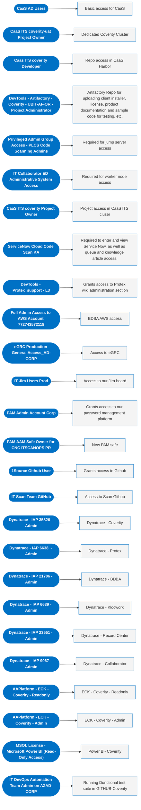

# 🗺️ Visual Product Map (Intel Onboarding)

LOCAl map. click on nodes to see documentation.

```mermaid
graph LR
    classDef category fill:#0071C5,stroke:#fff,stroke-width:2px,color:#fff,font-weight:bold;
    classDef product fill:#f4f4f4,stroke:#0071C5,stroke-width:1px,color:#333;
    CaaSADUsers(["CaaS AD Users"]):::category --> node_0["Basic access for CaaS"]:::product
    CaaSITScoverityuatProjectOwner(["CaaS ITS coverity-uat Project Owner"]):::category --> node_2["Dedicated Coverity Cluster"]:::product
    click node_2 "https://amr.caas.intel.com/" "Ver Wiki"
    CaasITScoverityDeveloper(["Caas ITS coverity Developer"]):::category --> node_4["Repo access in CaaS Harbor"]:::product
    click node_4 "https://amr-its-registry.caas.intel.com/" "Ver Wiki"
    DevToolsArtifactoryCoverityUBITAFORProjectAdministrator(["DevTools - Artifactory - Coverity - UBIT-AF-OR - Project Administrator"]):::category --> node_6["Artifactory Repo for uploading client installer, license, product documentation and sample code for testing, etc."]:::product
    click node_6 "https://ubit-artifactory-or.intel.com/ui/repos/tree/General/coverity-or-local" "Ver Wiki"
    PrivilegedAdminGroupAccessPLCSCodeScanningAdmins(["Privileged Admin Group Access - PLCS Code Scanning Admins"]):::category --> node_9["Required for jump server access"]:::product
    ITCollaboratorEDAdministrativeSystemAccess(["IT Collaborator ED Administrative System Access"]):::category --> node_10["Required for worker node access"]:::product
    CaaSITScoverityProjectOwner(["CaaS ITS coverity Project Owner"]):::category --> node_12["Project access in CaaS ITS cluser"]:::product
    click node_12 "https://amr.caas.intel.com/" "Ver Wiki"
    ServiceNowCloudCodeScanKA(["ServiceNow Cloud Code Scan KA"]):::category --> node_15["Required to enter and view Service Now, as well as queue and knowledge article access."]:::product
    DevToolsProtexsupportL3(["DevTools - Protex_support - L3"]):::category --> node_20["Grants access to Protex wiki administration section"]:::product
    FullAdminAccesstoAWSAccount772743572118(["Full Admin Access to AWS Account 772743572118"]):::category --> node_22["BDBA AWS access"]:::product
    eGRCProductionGeneralAccessADCORP(["eGRC Production General Access_AD-CORP"]):::category --> node_25["Access to eGRC"]:::product
    ITJiraUsersProd(["IT Jira Users Prod"]):::category --> node_27["Access to our Jira board"]:::product
    PAMAdminAccountCorp(["PAM Admin Account Corp"]):::category --> node_29["Grants access to our password management platform"]:::product
    PAMAAMSafeOwnerforCNCITSCANOPSPR(["PAM AAM Safe Owner for CNC ITSCANOPS PR"]):::category --> node_31["New PAM safe"]:::product
    1SourceGithubUser(["1Source Github User"]):::category --> node_34["Grants access to Github"]:::product
    ITScanTeamGitHub(["IT Scan Team GitHub"]):::category --> node_35["Access to Scan Github"]:::product
    DynatraceIAP35826Admin(["Dynatrace - IAP 35826 - Admin"]):::category --> node_37["Dynatrace - Coverity"]:::product
    DynatraceIAP6638Admin(["Dynatrace - IAP 6638  - Admin"]):::category --> node_38["Dynatrace - Protex"]:::product
    DynatraceIAP21706Admin(["Dynatrace - IAP 21706 - Admin"]):::category --> node_39["Dynatrace - BDBA"]:::product
    DynatraceIAP6639Admin(["Dynatrace - IAP 6639 - Admin"]):::category --> node_40["Dynatrace - Klocwork"]:::product
    DynatraceIAP23551Admin(["Dynatrace - IAP 23551 - Admin"]):::category --> node_41["Dynatrace - Record Center"]:::product
    DynatraceIAP9067Admin(["Dynatrace - IAP 9067 - Admin"]):::category --> node_42["Dynatrace - Collaborator"]:::product
    AAPlatformECKCoverityReadonly(["AAPlatform - ECK - Coverity - Readonly"]):::category --> node_43["ECK - Coverity - Readonly"]:::product
    AAPlatformECKCoverityAdmin(["AAPlatform - ECK - Coverity - Admin"]):::category --> node_44["ECK - Coverity - Admin"]:::product
    MSOLLicenseMicrosoftPowerBIReadOnlyAccess(["MSOL License - Microsoft Power BI (Read-Only Access)"]):::category --> node_46["Power BI- Coverity"]:::product
    ITDevOpsAutomationTeamAdminonAZADCORP(["IT DevOps Automation Team Admin on AZAD-CORP"]):::category --> node_48["Running Dunctional test suite in GITHUB-Coverity"]:::product
```
